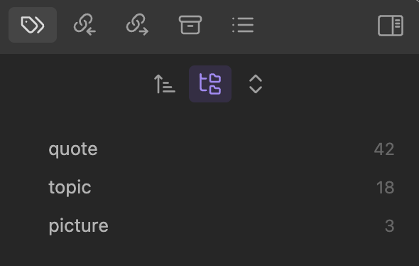

# Zettelkasten/Unidirectory Baschics

## Zettelkasten explained

### **Introduction**

The Zettelkasten system is a method of personal knowledge management, highly effective in organizing and understanding complex information. This system, while appearing unstructured at first, reveals its powerful design through a well-implemented linking and tagging structure.

### **What is a Zettelkasten System?**

"Zettelkasten" is a German term that translates to "slip box." The system involves writing down every idea, fact, or thought on individual "slips" (or notes) and then linking them in a non-linear fashion.

### **Key Features of Zettelkasten**

1. **Individual Notes for Ideas:** Each note in a Zettelkasten contains a single idea or piece of information. This ensures clarity and focus for each entry.
2. **Linking Notes:** Notes are interconnected based on related concepts, themes, or thoughts. These links create a web of knowledge that can evolve over time.
3. **Tagging System:** Tags or keywords are used to categorize notes, making it easier to retrieve related ideas and see patterns or themes across different notes.

   

4. **Incremental Growth:** The system grows as you add more notes, becoming more valuable and intricate over time.

### **Advantages for Creating a Thought Palace**

1. **Enhanced Organization:** Despite initial appearances, the Zettelkasten system is highly organized. The tagging and linking structure turns a collection of individual notes into a coherent and interconnected body of knowledge.
2. **Facilitates Creative Thinking:** By linking related ideas in unexpected ways, the system encourages the discovery of new connections and fosters creative thinking.
3. **Easily Tangible:** The use of tags makes navigating through a large number of notes manageable and intuitive. Users can quickly find related ideas or trace the development of their thoughts.
4. **Adaptable and Scalable:** The Zettelkasten system is highly adaptable to various fields and scales efficiently, making it suitable for both personal and professional knowledge management.
5. **Long-term Learning and Memory Retention:** By regularly interacting with and revisiting notes, users reinforce their understanding and memory of the material.

### **Conclusion**

The Zettelkasten system is more than a note-taking technique; it's a dynamic way to manage knowledge and foster creative thinking. Its non-linear, interconnected structure makes it an ideal tool for building a thought palace, where ideas can be stored, linked, and easily retrieved, leading to deeper understanding and innovation.

## Tags and Links (related)

### **Tagging System in the Zettelkasten**

The Zettelkasten utilizes a structured tagging system comprising three main categories: "quotes," "topics," and "pictures." This system enhances organization and allows for efficient retrieval and interconnection of information.

### 1. Quotes

- **Function:** Tags for direct quotations from various sources.
- **Usage:** Assign a "quotes" tag and link it to a topic tag to contextualize each quote within the broader knowledge framework.

### 2. Topics

- **Function:** Broad thematic categories that form the organizational backbone of the Zettelkasten.
- **Usage:** Every note, whether it's a quote, textual content, or picture, is linked to at least one "topic" tag, ensuring thematic coherence and easy retrieval.

### 3. Pictures

- **Function:** Tags for notes containing visual elements like images or diagrams.
- **Usage:** Tagged with "pictures" and relevant "topic" tags to integrate visual data into the thematic structure.

### Integration of Tags and links

- **Interrelatedness:** The user has to make that quotes and pictures are always linked to at least one topic, thus promoting a multidimensional and interconnected knowledge network.
- **Flexibility:** This tagging approach allows users to navigate seamlessly between different types of information, fostering a comprehensive understanding of subjects.

# How to recreate the Miro Board in the Unidirectory structure
The term "Unidirectory" is synonymous with Zettelkasten, and we use them interchangeably.

## Our best practices

All knowledge objects Topics, Subtopics, Quotes, Images etc. are stored in one directory:

These objects can be differentiated by the following #tags: quote, topic and picture

To add a tag to a Note like Interpretability you edit the property “tags” in the frontmatter/metadata of the Note and add the fitting “topic” tag.

You can then add content to this topic and link your Quotes their:

If you then look in the local graph of Interpretability you see that there are multiple arrows (you can turn them on in the settings panel) and two of them point to the mentioned quotes. You can also see other linked quotes that are not mentioned in the text. This is because these quotes relate to the Interpretability note in their “related” metadata.

You can navigate those quotes and see their content, local graph and metadata

Through the related property of Interpretability, you can navigate to its parent note “Definitions” and see its subtopics in the local graph.

When you want a full overview of you knowledge objects like the Miro Mindmap you can open the Graph View. Here we added some colors to those tags in the Graph View Settings panel to better distinguish the tags.

## Zettelkasten Customizations

If you need subtopics you can create them like so:
#topic/sub

If you want to describe a tag on a meta-level replace the #tag with [[link]]. Then you can explain the tag inside the link.

# Problems/Anmerkungen

## **Issues with Naming:**

The plugin employs a centralized directory for storing files, regardless of their associated topics. However, when files are labeled sequentially or identically across different topics, naming conflicts can arise.

## **Example Scenario:**

Consider two topics, TopicA and TopicB, each containing a file named "Quote1." In a graph view, these files are visually separated and associated with their respective topics. However, within the actual file directory, both files exist with the same name ("Quote1"), leading to potential confusion.

## **Recommendation:**

To avoid naming conflicts and enhance clarity, users are encouraged to adopt a mindful approach when manually naming files. The plugin itself does not currently include a dynamic naming solution, so users should be cautious about unintentionally overwriting files or creating confusion within the file system.
